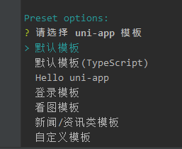
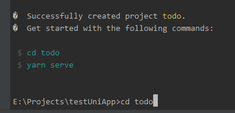
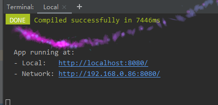
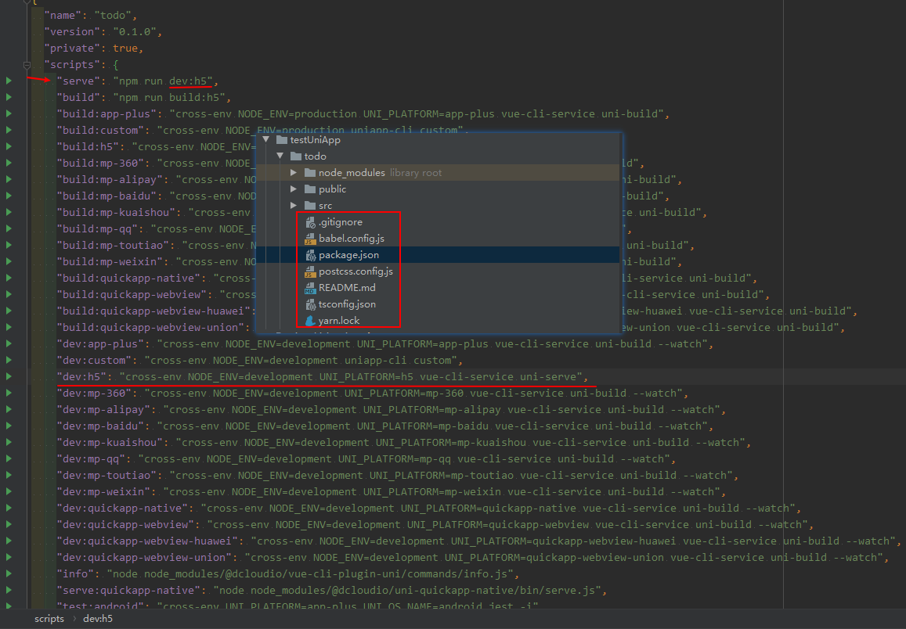

## vue-cli创建uniApp项目

[vue-cli官网][https://cli.vuejs.org/zh/guide/installation.html]

[uniApp官网][https://uniapp.dcloud.io/]

### 环境安装 

```javascript
全局安装vue-cli
npm install -g @vue/cli

创建UniApp
vue create -p dcloudio/uni-preset-vue 你的项目名
```

##### 注意：name不能包含大写字母


##### 选择模板



##### cd到目录，yarn serve || npm run serve 启动项目



##### 点击链接，查看页面

##### 项目生成文件




#### 阶段总结：

1，vue-cli生成的项目可以，用HbuilderX打开

2，H5环境与APP环境异同，APP环境读取不到window